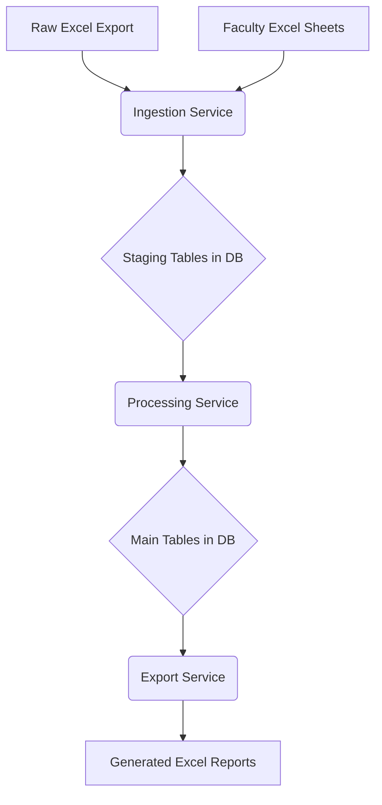

# Code Analysis and Refactoring Plan

## 1. Introduction

This document provides a detailed analysis of the data flow within the `easy-access-cli` application. It identifies key issues in the current architecture and proposes a concrete, step-by-step refactoring plan. The goal of the refactoring is to simplify the data flow, establish a single source of truth, and improve the overall maintainability and robustness of the codebase.

## 2. Current Data Flow Analysis

The core of the application is a data processing pipeline that ingests data from various sources, enriches it, and generates reports. The current data flow is complex and involves multiple, sometimes circular, steps.

### 2.1. High-Level Data Flow

The process is orchestrated by the `EasyAccessTool` class in `easy_access/main.py`. A typical run involves the following stages:

1.  **Initial Ingestion**: A raw data export from an external tool (in Excel format) is read and ingested into a SQLite database.
2.  **Synchronization from Sheets**: The application reads multiple Excel workbooks that have been manually edited by users. It then attempts to merge these changes into the database.
3.  **Enrichment**: The data is enriched with information scraped from external web sources (e.g., Osiris). This process involves creating intermediate JSON files.
4.  **Processing**: The application performs calculations on the data (e.g., calculating potential fines).
5.  **Report Generation**: The application generates a new set of Excel sheets (overviews, weekly reports) based on the processed data.

### 2.2. Visualization of Current Data Flow

```mermaid
graph TD
    A[Raw Excel Export] --> B{Ingest into DB};
    C[Faculty Excel Sheets] --> D{Merge into DB};
    B --> E[Load from DB to DataFrame];
    D --> E;
    E --> F{Enrichment (via JSON)};
    F --> G{Update DB};
    G --> H[Load from DB to DataFrame];
    H --> I{Calculations};
    I --> J{Update DB};
    J --> K[Load from DB to DataFrame];
    K --> L[Generate Excel Reports];
```

### 2.3. Key Issues

-   **No Single Source of Truth**: The application treats the raw Excel export, the faculty sheets, and the database as sources of truth at different times. This creates ambiguity and requires complex, error-prone logic to resolve conflicts.
-   **Circular and Inefficient Data Flow**: Data is repeatedly read from and written to the database and file system. For example, data is loaded from the DB into a DataFrame, processed, and then immediately written back. This is inefficient.
-   **Implicit Side Effects**: Functions often have side effects that are not obvious from their names. For instance, a function named `create_overviews` also modifies the database.
-   **Complex and Brittle Update Logic**: The logic for merging data from different sources is spread across multiple files (`main.py`, `db/update.py`) and is difficult to understand and maintain.

## 3. Proposed Refactoring Plan

The proposed refactoring aims to establish a clear, unidirectional data flow with the database as the single source of truth.

### 3.1. Guiding Principles

-   **The Database is the Single Source of Truth**: All data is stored in the SQLite database. Excel files are treated as either inputs for ingestion or outputs for reporting.
-   **Unidirectional Data Flow**: Data flows in one direction: `Ingestion -> Processing -> Export`.
-   **Clear Separation of Concerns**: The logic for ingestion, processing, and exporting data will be separated into distinct, well-defined modules.

### 3.2. Proposed New Data Flow



### 3.3. Detailed Implementation Steps

This plan is designed to be followed by a developer to implement the proposed changes.

#### 3.3.1. Step 1: Refactor the Database Schema (Completed)

-   **Status**: Done
-   **Files Modified**: `easy_access/db/models.py`
-   **Changes Made**:
    -   Added the `StagedCopyrightItem` model to serve as a staging area for raw data from Excel exports. This model uses simple field types to avoid validation errors during initial ingestion.
    -   Added the `StagedFacultyUpdate` model to stage data from manually edited faculty sheets. This table holds only the fields that users are allowed to edit.
-   **Reasoning**: The introduction of staging tables is the first step towards creating a unidirectional data flow. By first loading data into these tables, we separate the ingestion process from the processing and validation logic. This makes the ingestion step more robust and provides a clear point from which the data processing can begin.

#### 3.3.2. Step 2: Create a Centralized Data Pipeline Module (Completed)

-   **Status**: Done
-   **Files Modified**: `easy_access/pipeline.py` (created)
-   **Changes Made**:
    -   Created the new file `easy_access/pipeline.py`.
    -   Added a placeholder for the `DataPipeline` class. This class will orchestrate the entire data flow, from ingestion to export.
-   **Reasoning**: Centralizing the data flow logic in a single class will make the process much easier to understand, maintain, and debug. It provides a single point of entry for running the entire data pipeline.

#### 3.3.3. Step 3: Implement Ingestion Logic (Completed)

-   **Status**: Done
-   **Files Modified**: `easy_access/pipeline.py`, `easy_access/db/ingest.py`, `easy_access/sheets/sheet.py`
-   **Changes Made**:
    -   Implemented the `ingest_raw_data` and `ingest_faculty_updates` methods in the `DataPipeline` class.
    -   Created new functions `load_raw_copyright_data_to_staging` and `load_faculty_updates_to_staging` in `easy_access/db/ingest.py` to handle loading data into the new staging tables.
    -   Created the `read_faculty_sheets` function in `easy_access/sheets/sheet.py`.
    -   Refactored the old `load_raw_copyright_data` function to be a placeholder.
-   **Reasoning**: These changes move the responsibility of data ingestion into the new `DataPipeline`, making the process more explicit and centralized. The use of staging tables isolates the raw data from the main application data.

#### 3.3.4. Step 4: Refactor the Main Application Entry Point (Completed)

-   **Status**: Done
-   **Files Modified**: `easy_access/main.py`
-   **Changes Made**:
    -   The `EasyAccessTool` class has been simplified. The `run` method now instantiates the `DataPipeline` class and calls its `run` method.
    -   The old data processing methods and the `set_functions` method have been removed.
-   **Reasoning**: This change centralizes the control of the data processing workflow within the `DataPipeline` class, making the `EasyAccessTool` class a simpler entry point.

#### 3.3.5. Step 5: Implement Data Processing Logic (In Progress)

-   **Status**: In Progress
-   **Files Modified**: `easy_access/pipeline.py`
-   **Changes Made**:
    -   Added a placeholder for the `process_data` method in the `DataPipeline` class.
    -   Updated the `run` method to call `process_data`.
-   **Reasoning**: This sets up the structure for the next major phase of the refactoring, which will be to implement the logic for processing the staged data and updating the main `CopyrightItem` table.
