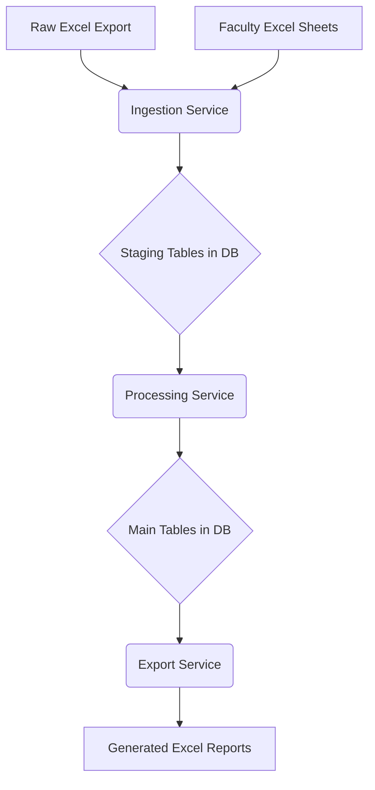

# Code Analysis and Refactoring Plan

## 1. Introduction

This document provides a detailed analysis of the data flow within the `easy-access-cli` application. It identifies key issues in the current architecture and proposes a concrete, step-by-step refactoring plan. The goal of the refactoring is to simplify the data flow, establish a single source of truth, and improve the overall maintainability and robustness of the codebase.

## 2. Current Data Flow Analysis

The core of the application is a data processing pipeline that ingests data from various sources, enriches it, and generates reports. The current data flow is complex and involves multiple, sometimes circular, steps.

### 2.1. High-Level Data Flow

The process is orchestrated by the `EasyAccessTool` class in `easy_access/main.py`. A typical run involves the following stages:

1.  **Initial Ingestion**: A raw data export from an external tool (in Excel format) is read and ingested into a SQLite database.
2.  **Synchronization from Sheets**: The application reads multiple Excel workbooks that have been manually edited by users. It then attempts to merge these changes into the database.
3.  **Enrichment**: The data is enriched with information scraped from external web sources (e.g., Osiris). This process involves creating intermediate JSON files.
4.  **Processing**: The application performs calculations on the data (e.g., calculating potential fines).
5.  **Report Generation**: The application generates a new set of Excel sheets (overviews, weekly reports) based on the processed data.

### 2.2. Visualization of Current Data Flow

```mermaid
graph TD
    A[Raw Excel Export] --> B{Ingest into DB};
    C[Faculty Excel Sheets] --> D{Merge into DB};
    B --> E[Load from DB to DataFrame];
    D --> E;
    E --> F{Enrichment (via JSON)};
    F --> G{Update DB};
    G --> H[Load from DB to DataFrame];
    H --> I{Calculations};
    I --> J{Update DB};
    J --> K[Load from DB to DataFrame];
    K --> L[Generate Excel Reports];
```

### 2.3. Key Issues

-   **No Single Source of Truth**: The application treats the raw Excel export, the faculty sheets, and the database as sources of truth at different times. This creates ambiguity and requires complex, error-prone logic to resolve conflicts.
-   **Circular and Inefficient Data Flow**: Data is repeatedly read from and written to the database and file system. For example, data is loaded from the DB into a DataFrame, processed, and then immediately written back. This is inefficient.
-   **Implicit Side Effects**: Functions often have side effects that are not obvious from their names. For instance, a function named `create_overviews` also modifies the database.
-   **Complex and Brittle Update Logic**: The logic for merging data from different sources is spread across multiple files (`main.py`, `db/update.py`) and is difficult to understand and maintain.

## 3. Proposed Refactoring Plan

The proposed refactoring aims to establish a clear, unidirectional data flow with the database as the single source of truth.

### 3.1. Guiding Principles

-   **The Database is the Single Source of Truth**: All data is stored in the SQLite database. Excel files are treated as either inputs for ingestion or outputs for reporting.
-   **Unidirectional Data Flow**: Data flows in one direction: `Ingestion -> Processing -> Export`.
-   **Clear Separation of Concerns**: The logic for ingestion, processing, and exporting data will be separated into distinct, well-defined modules.

### 3.2. Proposed New Data Flow



### 3.3. Detailed Implementation Steps

This plan is designed to be followed by a developer to implement the proposed changes.

#### Step 1: Refactor the Database Schema

-   **Goal**: Introduce staging tables to separate raw ingested data from processed data.
-   **File**: `easy_access/db/models.py`
-   **Actions**:
    1.  Create a new model, `StagedCopyrightItem`, with a schema that closely matches the raw Excel export. This table will be used to temporarily store data from the raw export.
    2.  Create another new model, `StagedFacultyUpdate`, to store data from the faculty sheets. It should contain `material_id` and the fields that can be edited by users (e.g., `manual_classification`, `remarks`, `workflow_status`).

#### Step 2: Create a Centralized Data Pipeline Module

-   **Goal**: Consolidate the data flow logic into a single, easy-to-understand module.
-   **New File**: `easy_access/pipeline.py`
-   **Actions**:
    1.  Create a new `DataPipeline` class in this file.
    2.  Implement an `ingest_raw_data(file_path)` method. This method will:
        -   Read the raw Excel export.
        -   Load the data into the `StagedCopyrightItem` table.
        -   This replaces the logic in `sheets.sheet.read_copyright_export` and parts of `db.ingest.load_raw_copyright_data`.
    3.  Implement an `ingest_faculty_updates()` method. This method will:
        -   Read all faculty Excel sheets.
        -   Load the editable fields into the `StagedFacultyUpdate` table.
        -   This replaces the logic in `main.EasyAccessTool.update_db_from_faculty_sheets`.
    4.  Implement a `process_data()` method. This method will:
        -   Read from the staging tables.
        -   Apply business logic to merge the staged data into the main `CopyrightItem` table. The rule should be simple: updates from `StagedFacultyUpdate` overwrite the corresponding fields in `CopyrightItem`.
        -   Perform all data enrichment and calculations.
        -   This replaces the complex logic in `db.update.update_copyright_items` and the scattered processing logic.
    5.  Implement an `export_reports()` method. This method will:
        -   Read from the main `CopyrightItem` table.
        -   Generate all necessary Excel reports.
        -   This replaces the logic in `sheets.analysis.create_faculty_overviews` and `sheets.sheet.create_export_sheet`.

#### Step 3: Refactor the Main Application Entry Point

-   **Goal**: Simplify the `EasyAccessTool` to be a dispatcher that calls the new data pipeline.
-   **File**: `easy_access/main.py`
-   **Actions**:
    1.  Remove the complex data processing methods from `EasyAccessTool`.
    2.  The `run` method should now instantiate the `DataPipeline` class and call its methods in the correct order: `ingest_raw_data`, `ingest_faculty_updates`, `process_data`, `export_reports`.

#### Step 4: Clean Up Old Modules

-   **Goal**: Remove the now-redundant code from the old modules.
-   **Files**: `easy_access/db/ingest.py`, `easy_access/db/update.py`, `easy_access/sheets/analysis.py`, `easy_access/sheets/sheet.py`
-   **Actions**:
    1.  Remove the functions that have been replaced by the new `DataPipeline` methods.
    2.  The `db` modules should now only contain the database models and basic helper functions (like `ensure_db_inited`).
    3.  The `sheets` modules should only contain helper functions for creating and styling Excel sheets, with the data being passed in as an argument.

By following these steps, the application will be refactored into a much more robust and maintainable state. The data flow will be clear and predictable, and the separation of concerns will make it easier to add new features or fix bugs in the future.
