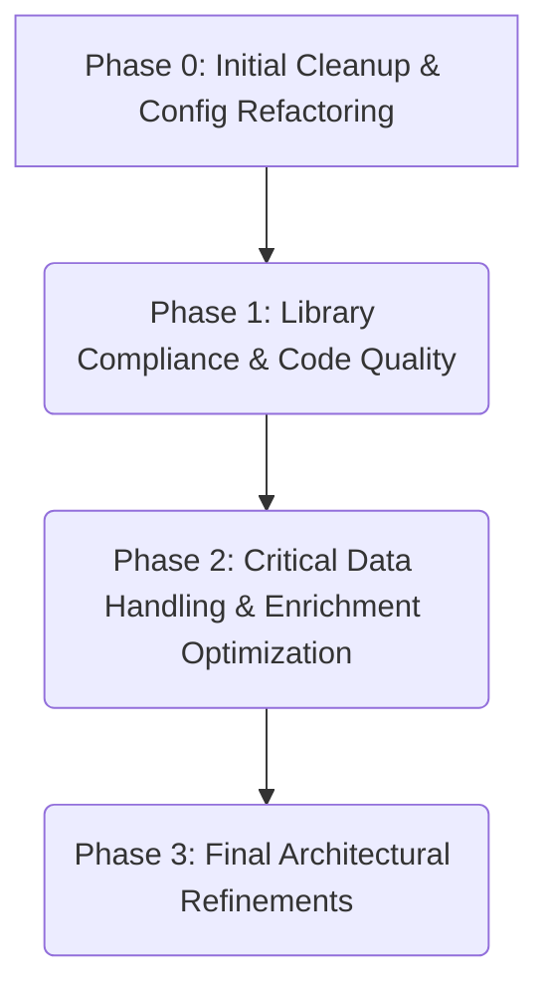

## Final Refactoring Plan: 'easy_access' Project

**I. Issue Prioritization Summary (Final)**

1.  **P1: Foundational Clarity & Configuration (High Impact, High Urgency)**
    *   **Key Issues:** Initial `ruff` compliance, fixing critical file handling, cleaning up temporary/commented code, initial decoupling of global `SETTINGS` (dependency injection), resolving `classification_options` (use dropdown as primary, handle legacy values), refactoring CLI (`run.py`), standardizing configuration loading.
    *   **Effort Estimate:** Mix of Small to Large tasks.
2.  **P2: Core Functionality & Guideline Adherence (High Impact, Medium Urgency)**
    *   **Key Issues:** Ensuring full library compliance (using `polars`, `httpx`, etc., removing `openpyxl` direct use & `pdfreader`), comprehensive type hinting and docstringing.
    *   **Effort Estimate:** Mix of Medium to Large tasks. Type hinting/docstrings is Large (ongoing).
3.  **P3: Data Handling & Core Logic (Critical Impact, High Urgency)**
    *   **Key Issues:** Addressing complex data merging and integrity problems (SQLite as SoT, robust conflict resolution for multiple sources). **Optimizing enrichment process** ([`easy_access/sheets/enrichment.py`](easy_access/sheets/enrichment.py:1) - focus on reducing file-based operations, using `polars`/SQLite directly, improving matching/parsing logic, potentially using structural pattern matching). Implementing missing features, enhancing error handling.
    *   **Effort Estimate:** Mostly Large, complex tasks. Data merging and enrichment optimization are critical.
4.  **P4: Architectural Refinements & Long-term Maintainability (Medium Impact, Lower Urgency)**
    *   **Key Issues:** Clarifying sub-project/workspace architecture.
    *   **Effort Estimate:** Small to Medium tasks.

**II. Proposed Refactoring Roadmap (Final)**

Test suite implementation is deferred.

**Phase 0: Initial Cleanup & Configuration Refactoring**
*   **Goal:** Improve modularity, testability, and clarity of core components and configuration handling.
*   **Key Steps:**
    1.  **Initial Code Health Cleanup:** Address basic `ruff` issues, fix `open()` calls, remove commented/temporary code.
    2.  **Refactor Settings Handling:** Implement dependency injection for `SETTINGS`.
    3.  **Standardize `classification_options`:**
        *   Use `data_settings.data_entry_cols.manual_classification.dropdown_options` from [`settings.yaml`](settings.yaml:1) as the definitive list.
        *   Ensure robust handling of any legacy/non-standard values encountered in raw data during ingestion, possibly mapping them to a default/unknown category or logging them.
    4.  **Refactor CLI (`run.py`):** Improve structure, potentially using `typer` sub-commands.
    5.  **Standardize Configuration Loading:** Move hardcoded configs; clarify/rename `EasyAccessSettings.from_env`.

**Phase 1: Library Compliance & Code Quality Enhancement**
*   **Goal:** Ensure strict adherence to project guidelines and improve overall code quality.
*   **Key Steps:**
    1.  **Ensure Library Compliance:** Remove `openpyxl` (direct use) and `pdfreader`. Verify correct usage of specified libraries (`polars`, `xlsxwriter`, `httpx`, ORMs, PDF tools).
    2.  **Comprehensive Type Hinting & Docstrings:** Systematically update across the codebase.

**Phase 2: Critical Data Handling & Enrichment Optimization**
*   **Goal:** Address core data processing issues, optimize performance-critical sections, implement missing functionality, and enhance robustness.
*   **Key Steps:**
    1.  **Critical - Refactor Data Merging & Integrity:**
        *   Design and implement a robust data flow and conflict resolution strategy for multiple data sources (SQLite, raw Excel, weekly sheets, faculty sheets), ensuring SQLite remains the source of truth.
        *   Develop a clear method for tracking changes and determining the 'actual' current value when conflicts arise.
        *   Refactor or replace the existing logic in `easy_access/db/update.py`.
        *   Make mapping logic (e.g., `department_mapping`) data-driven.
    2.  **Critical - Optimize Enrichment Process ([`easy_access/sheets/enrichment.py`](easy_access/sheets/enrichment.py:1)):**
        *   Reduce reliance on intermediate file-based operations; use `polars` DataFrames in memory or SQLite tables directly for staging/processing data.
        *   Refactor fuzzy matching and parsing logic for efficiency and accuracy.
        *   Explore using Python's structural pattern matching (match-case) for clearer conditional logic if applicable.
        *   Optimize database interactions within the enrichment process.
    3.  **Implement Missing Features & Enhance Error Handling:** Complete "not implemented" sections, improve error handling throughout.

**Phase 3: Final Architectural Refinements**
*   **Goal:** Address remaining structural points for long-term maintainability.
*   **Key Steps:**
    1.  **Clarify Sub-project Architecture:** Document structure for `pdf_downloads` etc.